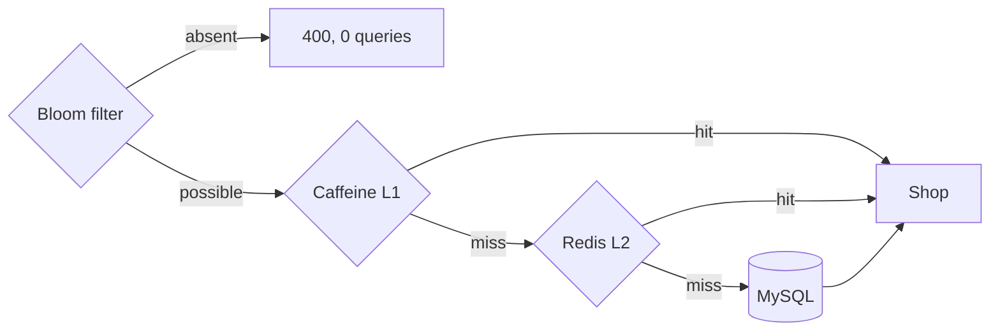
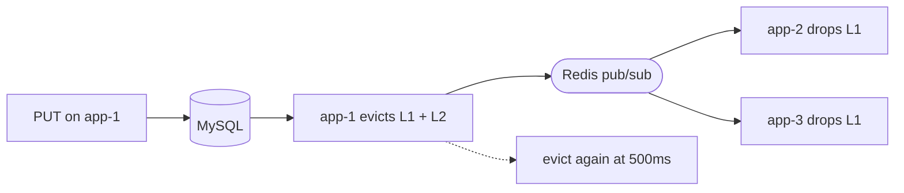
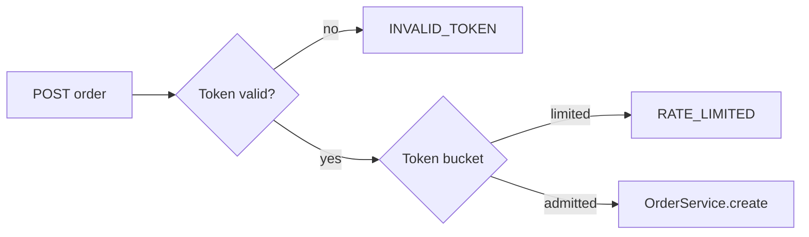

# MartHub — High-Concurrency E-Commerce Backend

[](https://github.com/YuemengZheng/marthub-ecommerce-backend/actions/workflows/ci.yml)

A compact Spring Boot implementation of three backend mechanisms, each with a measurement to go with it: multi-level caching, pre-order traffic gating, and Redis-backed distributed sessions.

## The read path

Every tier exists to stop a request before it reaches the one below it. The Bloom
filter is first because an id that was never in the database should not cost a cache
lookup either.



A hit below L1 backfills every tier above it on the way out.

## Keeping three L1 caches honest

Caffeine is per-process, so a write on one instance leaves the other two holding a
stale shop until their TTL expires. Redis pub/sub closes that gap, and a second
eviction fires shortly after to catch a read that repopulated the cache from a
transaction that had not committed yet.



Measured across all three instances after a write: 0 stale reads in 45 requests.

## Admission before order processing

Two stages, both ahead of `OrderService`. The token is issued once per user per item
and reused on retry, so refreshing does not drain the gate; the bucket is a Lua script
in Redis, so three instances share one limit rather than three.



50 invalid requests reached `OrderService` in the legacy shape and 0 here, at a cost
of 0 incremental MySQL SELECTs instead of 150. A 100-request burst on a valid token
admitted exactly the configured 20.

## What the code proves

### 1) Hot read path: Caffeine L1 + Redis L2 + Bloom filter + delayed invalidation

`ShopService#get` uses a local Caffeine cache first, Redis second, and MySQL only on a miss. `BloomFilterRegistry` rejects definitely-absent shop IDs before either cache/DB path. `ShopService#update` evicts L1/L2 immediately after the DB update and schedules a second eviction after a short delay to close the stale-write race window.

Key files:
- `src/main/java/dev/yuemeng/marthub/shop/ShopService.java`
- `src/main/java/dev/yuemeng/marthub/cache/LongBloomFilter.java`
- `src/main/java/dev/yuemeng/marthub/cache/BloomFilterRegistry.java`

### 2) Two-stage eligibility-token + rate-limiting pipeline

The first endpoint validates sale/user state and issues a short-lived Redis eligibility token. Repeated issuance for the same user/item atomically reuses the existing token, so retries do not drain the global gate. The order endpoint rejects an invalid token or a Redis token-bucket rate-limit failure **before** entering `OrderService#create`.

Key files:
- `flashsale/EligibilityService.java`
- `flashsale/RedisRateLimiter.java`
- `flashsale/FlashSaleService.java`
- `flashsale/OrderService.java`

The benchmark includes a legacy-shaped baseline where invalid traffic reaches the order-processing boundary first, then compares it with the optimized pipeline. With 50 intentionally invalid requests, the optimized design should record zero order-processor entries. A separate valid-token burst sends 100 concurrent admission requests so the Redis token-bucket is exercised directly; allowed vs rate-limited requests are recorded instead of hard-coded.

### 3) Redis token authentication + dual interceptors + 3 instances

`RefreshTokenInterceptor` runs first on every request, resolves a Bearer token from Redis, places the user in a request-local context, and renews TTL. `LoginInterceptor` runs second only on protected routes. `docker-compose.yml` runs **3 Spring Boot instances** behind Nginx; all share Redis. Every response includes `X-MartHub-Instance` so the benchmark can prove a single token remains valid while requests rotate across all three instances.

Key files:
- `auth/AuthService.java`
- `auth/RefreshTokenInterceptor.java`
- `auth/LoginInterceptor.java`
- `config/WebConfig.java`
- `docker-compose.yml`
- `infra/nginx.conf`

## Run

Requirements: Docker + Docker Compose.

```bash
docker compose up --build
```

Then:

```bash
curl -X POST 'http://localhost:8080/api/auth/demo-login?userId=1&name=Demo'
```

Use the returned token:

```bash
curl -H 'Authorization: Bearer YOUR_TOKEN' http://localhost:8080/api/shops/1
```

## Tests

```bash
docker run --rm -d -p 6379:6379 redis:7.4-alpine
mvn test
```

48 tests. Most are plain unit tests with no infrastructure, but the eligibility gate
and the token bucket are Lua scripts, and a mocked `StringRedisTemplate` cannot say
anything about whether a script is atomic — so those run against a real Redis, with
real threads. `EligibilityGateLuaTest` fires 64 concurrent issues for one user and
asserts that exactly one token comes back and exactly one gate slot is spent.

Without a reachable Redis those 8 tests skip rather than fail, so `mvn test` still
passes on a machine without Docker. CI supplies Redis as a service container and then
fails the build if anything was skipped, so the skip cannot quietly become permanent.
Set `MARTHUB_TEST_REDIS=host:port` to point them somewhere other than `localhost:6379`.

## Benchmarks

The `/internal/benchmark/**` endpoints exist so the measurements below can be
reproduced. They bypass the login interceptor and are therefore gated by
`marthub.benchmark.enabled`, which defaults to **false**; `docker-compose.yml` turns
them on for the local stack only. Do not enable them anywhere reachable.

```bash
python3 benchmarks/benchmark.py
python3 benchmarks/db_load.py
cat benchmarks/results.json benchmarks/db_load_results.json
```

`benchmark.py` measures:
1. DB-only p95 vs warmed multi-level-cache p95.
2. 50 invalid order attempts in a baseline flow vs pre-order rejection in the optimized flow, plus p95.
3. Whether repeated eligibility requests reuse the same Redis token.
4. A 100-request valid-token burst that must trigger the Redis token-bucket before the order boundary.
5. Whether one Redis session token succeeds while Nginx rotates requests across all 3 instances.

`db_load.py` measures the DB work each path avoids, straight from MySQL's
`Com_select` counter: 2,000 cached reads cost 0 incremental SELECTs against 2,000
for the DB-only path, and 50 invalid flash-sale requests cost 0 against 150.

**The p95 fields in `results.json` do not show a cache win, and I would rather say so
here than let the file imply one.** On a loopback stack with a 3-row table the cached
and DB-only paths measure the same p95; the large gap on the first run after
`docker compose up` is JVM warm-up. `TEST_STATUS.md` has the ApacheBench numbers and
the reasoning.

## What the measurements support

Measured on 2026-08-11, full numbers in `TEST_STATUS.md`:

- **Cache:** 2,000 warm-cache reads cost 0 incremental MySQL SELECTs, against 2,000
  for the DB-only path. 2,000 reads for an id that does not exist also cost 0,
  because the Bloom filter rejects them before either cache or DB.
- **Traffic gating:** 50 invalid requests reached the order processor in the legacy
  shape and 0 in the optimized pipeline, eliminating 150 incremental SELECTs. A
  100-request burst on a valid token admitted exactly the configured 20.
- **Distributed sessions:** one Redis token stayed valid across all 3 instances, and
  a write produced 0 stale reads cluster-wide.

The counter proves *requests reaching order processing*, which is a narrower and more
honest statement than "invalid orders" — an invalid order was never created either
way; the point is that the work is refused before the order path is entered.

## Attribution / provenance

This repository is an independent implementation. No source file was copied from the public HMDP or SecKill repositories. See `ATTRIBUTION.md` for the architectural references used while reconstructing the project.
