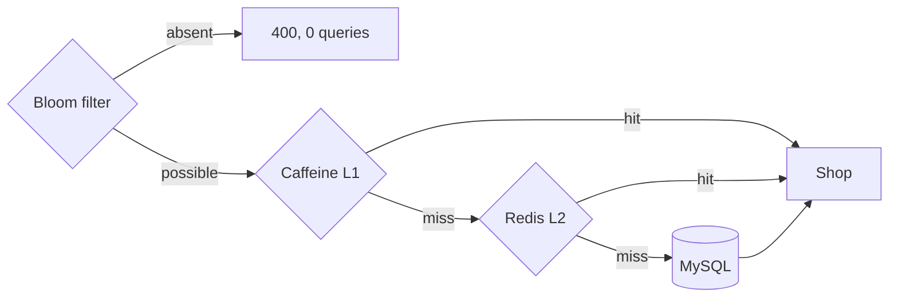

# MartHub — High-Concurrency E-Commerce Backend

[](https://github.com/YuemengZheng/marthub-ecommerce-backend/actions/workflows/ci.yml)

A compact Spring Boot service built around three mechanisms, each with a measurement
to go with it: a multi-level read cache, a flash-sale admission layer, and Redis-backed
distributed sessions.

Every measurement here comes from a counter this codebase does not own — MySQL's
`Com_select`, Caffeine's own `stats()`, Redis's `total_commands_processed`, or a
wall-clock timer in the load client. Where a number turned out to restate its own
configuration, it was removed rather than rounded up; see [Benchmarks](#benchmarks).

## The read path

Every tier exists to stop a request before it reaches the one below it. The Bloom
filter is first because an id that was never in the database should not cost a cache
lookup either.



A hit below L1 backfills every tier above it on the way out.

Catalogue `GET`s are public, which is a deliberate availability decision rather than a
missing rule: it is what lets a read be served from L1 while Redis is unreachable. With
authentication in front, the session lookup would fail first and the local cache would
never be consulted. Measured with Redis paused: `GET /api/shops/1` returns 200 from L1,
`GET /api/auth/me` returns 503.

## Keeping three L1 caches honest

Caffeine is per-process, so a write on one instance leaves the other two holding a
stale shop until their TTL expires. Redis pub/sub closes that gap, and a second
eviction fires shortly after to catch a read that repopulated the cache from a
transaction that had not committed yet.


Eviction runs after the transaction commits, not inside it. Running it inside meant the
first eviction landed before the commit, so the code was compensating for a window it
created itself. The delayed second eviction still exists, for the narrower race where
another instance repopulates from a read that started before the commit landed — it is
best-effort and non-durable; an outbox or CDC feed is what makes it reliable.

Key files: `shop/ShopService.java`, `cache/BloomFilterRegistry.java`,
`cache/CacheInvalidationListener.java`

## Admission before order processing

Six gates, ordered so the cheapest and most final answers come first. Most flash-sale
traffic never reaches the end of this list, which is the point: a request that cannot
succeed should find that out for the price of one Redis lookup, not a lock on the
hottest row in the database.

```text
POST /api/flash-sale/{itemId}/orders
  |
  |-- already bought?   --> 200, that order id      1 Redis lookup
  |-- sold out?         --> 400 SOLD_OUT            2
  |-- token valid?      --> 400 INVALID_TOKEN       3
  |-- acquire lease     --> 409 IN_PROGRESS         4
  |-- item token bucket --> 400 RATE_LIMITED        5
  |
  v
  UPDATE stock WHERE stock > 0   +   INSERT order        <-- first MySQL contact
  |
  |-- 0 rows        --> 400 SOLD_OUT, and remember it
  |-- uq_user_item  --> read the id back, 200
  |
  v
  record order id  ->  revoke token  ->  release lease
```

Each gate answers a different question, and none of them overlaps:

| Mechanism | Question it answers |
| --- | --- |
| `fs:bought:{item}:{user}` → order id | has this already succeeded? |
| `fs:soldout:{item}` | is the sale over? |
| eligibility token + gate counter | may this caller compete at all? |
| `fs:processing:{item}:{user}` lease | is one attempt from this caller already in flight? |
| per-item token bucket | is total throughput within budget? |
| `uq_user_item` | **the only thing that makes any of it correct** |

Three points that are easy to get wrong here:

**A repeat is a replay, not an error.** The bought marker holds the order id, so a
repeated request returns 200 and that id. A client whose response was lost on the
network has an order and should be told which one. The marker is only a cache, so a
unique-constraint violation also reads the id back from `orders` — resolved strictly
outside the transaction, because catching it inside and committing would decrement
stock with no order to match it.

**The lease is an optimization, not a safety mechanism.** It expires on a timer and
carries no fencing token, so two attempts can overlap. `uq_user_item` is what prevents
a double order. The lease only sheds duplicate work before it reaches the shared bucket
or the database. It is released by compare-and-delete in Lua, because a plain `DEL`
would release whoever holds the key once your own lease has expired.

**Its TTL is a correctness parameter, and it is only boundable because the work it
covers is.** InnoDB waits 50s for a row lock by default, which is longer than any
sensible lease, so `innodb_lock_wait_timeout` is capped at 3s per connection and a wait
that runs out surfaces as `503 CONTENDED`.

There is no per-user rate limit in the application. Bounding how many requests one
caller may send belongs at the edge — Nginx keys a `limit_req` zone on the session
token. Inside the service, "one attempt at a time" is stated directly by the lease
rather than approximated by a bucket.

Key files: `flashsale/FlashSaleService.java`, `flashsale/EligibilityService.java`,
`flashsale/ProcessingGuard.java`, `flashsale/RedisRateLimiter.java`,
`flashsale/OrderService.java`, `infra/nginx.conf`

## Sessions

Three instances behind Nginx, so any request can land anywhere. Session state lives in
Redis via Spring Session, and authorization is Spring Security's — the session id
travels in the `X-Auth-Token` header, which is Spring Session's own mechanism under
`HeaderHttpSessionIdResolver`, not something assembled here.

This replaced a hand-written version — a UUID in a Redis hash, two interceptors and a
ThreadLocal, 83 lines. It worked, but every question asked of it landed on something it
did not do: no absolute timeout, no logout, and protected routes were a whitelist, so
anything added later was public by default. Continuing down that path meant hand-building
a small Spring Session. Routing now denies by default, and the one thing the framework
does not provide — an absolute session lifetime — is a single filter.

`demo-login` takes a user id and issues a session. There is no password and no
credential store: it is a stub standing in for authentication so the parts this project
is about can be exercised. Calling this an authentication system would be wrong; it is
session and authorization infrastructure with the credential step left as a seam.

Key files: `config/SecurityConfig.java`, `auth/AbsoluteSessionLifetimeFilter.java`,
`auth/DependencyUnavailableFilter.java`, `auth/SessionUser.java`

## Run

Requirements: Docker + Docker Compose.

```bash
docker compose up --build
```

```bash
curl -i -X POST 'http://localhost:8080/api/auth/demo-login?userId=1&name=Demo'
```

The session id comes back in the `X-Auth-Token` response header. Send it back the same
way:

```bash
curl -H 'X-Auth-Token: YOUR_SESSION_ID' http://localhost:8080/api/auth/me
```

Catalogue reads need no session at all:

```bash
curl http://localhost:8080/api/shops/1
```

## Tests

```bash
docker run --rm -d -p 6379:6379 redis:7.4-alpine
mvn test
```

73 tests. Most are plain unit tests with no infrastructure, but the eligibility gate,
the token bucket and the processing lease are Lua scripts, and a mocked
`StringRedisTemplate` cannot say anything about whether a script is atomic — so those
run against a real Redis, with real threads. `EligibilityGateLuaTest` fires 64
concurrent issues for one user and asserts that exactly one token comes back and
exactly one gate slot is spent; `ProcessingGuardLuaTest` fires 32 and asserts that
exactly one is admitted, and that a holder whose lease has expired cannot release the
next holder's.

Without a reachable Redis the Redis-dependent tests skip rather than fail, so `mvn test`
still passes on a machine without Docker. CI supplies Redis as a service container and
then fails the build if anything was skipped, so the skip cannot quietly become
permanent. Set `MARTHUB_TEST_REDIS=host:port` to point them somewhere other than
`localhost:6379`.

## Benchmarks

The `/internal/benchmark/**` endpoints exist so the measurements below can be
reproduced. They are gated by `marthub.benchmark.enabled`, which defaults to **false**;
`docker-compose.yml` turns them on for the local stack only. Do not enable them anywhere
reachable.

The app containers are not published on the host by the committed compose file, so the
cache profile needs them exposed to read each instance's own Caffeine counters. Add a
local `docker-compose.override.yml`:

```yaml
services:
  app1: { ports: ["8091:8080"] }
  app2: { ports: ["8092:8080"] }
  app3: { ports: ["8093:8080"] }
```

```bash
# Load goes through Nginx; the instance list is only for summing per-process counters.
MARTHUB_BASE_URL=http://localhost:8080 \
MARTHUB_INSTANCE_URLS=http://localhost:8091,http://localhost:8092,http://localhost:8093 \
  python3 benchmarks/cache_profile.py

python3 benchmarks/burst_load.py

# This one talks to a single instance on purpose -- through Nginx the edge rate limit
# would throttle the loop and the numbers would describe limit_req instead.
MARTHUB_INSTANCE_URL=http://localhost:8091 python3 benchmarks/stage_latency.py

cat benchmarks/*_results.json
```

**`cache_profile.py`** drives 20,000 Zipf-distributed reads over 10,000 shops and
controls its own starting state, so the hit rate comes with a stated key distribution
and a stated warm-up:

| Case | MySQL reads | L1 hit rate |
| --- | --- | --- |
| No cache in the path | 20,043 | — |
| Cold start | 3,495 (**−82.6%**) | 74.7% |
| Steady state | 1 | 84.2% |
| All three instances restarted, Redis warm | 1 | 74.8% |
| 2,000 ids that were never in the table | 2 (noise floor), all `400` | — |

Two of those are worth reading twice. The cold-start figure is close to the number of
*distinct* keys the workload touches (3,464), which is the floor for "each unique key
costs at most one database read" — so it is near the ceiling for this workload, not a
tuning result. And restarting every instance costs the database nothing, which is the
one case that justifies the second tier existing at all.

**`burst_load.py`** offers 1,000 / 5,000 / 10,000 requests at concurrency 200, 30% of
them carrying tokens that were never issued, from 500 distinct callers.

| Offered | Baseline DB reads per request | Admitted | Admitted share |
| --- | --- | --- | --- |
| 1,000 | 3.0 | 270 | 27.0% |
| 5,000 | 3.0 | 487 | 9.7% |
| 10,000 | 3.0 | 778 | 7.8% |

**This deliberately does not report a "percent reduction", and the reason is the more
useful half of the result.** Admitted volume comes out of one token bucket, so it is
rate × wall-clock + burst; the measured ratio to that prediction is 0.985 / 0.994 /
0.997 across the sweep. A percentage built on it would restate the configured capacity
and how long the client happened to take. What survives is the shape: baseline database
cost is linear in offered load, while the admitted share falls as load rises.

**`stage_latency.py`** exists because command counts were being read as network round
trips. They are not the same thing — the client multiplexes and the framework may batch
its writes — so this measures wall-clock cost per stage instead, by difference across
three endpoints, against one instance directly so Nginx is out of the path.

| | p50 | p95 |
| --- | --- | --- |
| Public read, no Redis, warm L1 | 1.37 ms | 2.50 ms |
| + session read and save | 2.66 ms | 4.92 ms |
| + full admission, no MySQL | 3.52 ms | 5.30 ms |

Session costs more than the whole admission chain, and both sit around a millisecond.
That is why the admission checks have **not** been merged into one Lua script: the
saving is not worth losing per-gate testability and rejection reasons, and multi-key Lua
would also constrain any future Redis Cluster key layout. Quantiles do not add, so the
p95 differences in particular are an order-of-magnitude estimate, not a decomposition.

Every table above is one run, not an average. Repeated runs move the cold-start figure
between 82.5% and 82.6%, the L1 hit rates by a few tenths, and the stage deltas by about
0.1 ms — the ordering has been stable across every run, the third decimal place has not.
Re-run the scripts rather than trusting the numbers copied here.

## Open items

Known and deliberate, in the order they actually matter.

1. **Redis is a single failure domain carrying eight roles** — sessions, L2 cache,
   invalidation pub/sub, eligibility tokens, the gate counter, bought markers, sold-out
   flags, rate-limit buckets — with no replica, no `maxmemory`, no eviction policy, no
   container memory limit and no `-Xmx`. This outranks every performance item below it.
   The roles also have incompatible failure semantics: a cache entry lost is a slow
   request, a session lost is a logged-out user, an admission key lost breaks idempotency.
   One instance takes one `maxmemory-policy`, so "LRU for the cache" and "never evict
   sessions" cannot both hold while they share an instance — that conflict is itself the
   argument for splitting them.
2. **No negative caching.** The Bloom filter's ~1% false-positive rate means that set of
   absent ids reaches MySQL on every request, indefinitely.
3. **The delayed second eviction is non-durable.** If the process dies in the 500ms
   window, it never happens. An outbox or CDC feed is the fix.
4. **No global rate limit across items.** Fifty concurrent sales each honouring their own
   per-item budget can still overwhelm the database together.
5. **Rejections are not counted by reason.** `SOLD_OUT`, `INVALID_TOKEN`, `IN_PROGRESS`,
   `RATE_LIMITED` and `CONTENDED` are distinct in the response but share one counter, so
   a rising rejection rate does not say which of them rose.
6. **No concurrency test for overselling.** The conditional `UPDATE` and `uq_user_item`
   are exercised, but "N buyers, M units, exactly M orders" is not asserted.
7. **Token issuance still reads MySQL** on every call for a live item, with no bucket in
   front of it inside the application.

## Attribution / provenance

This repository is an independent implementation. No source file was copied from the
public HMDP or SecKill repositories. See `ATTRIBUTION.md` for the architectural
references used while reconstructing the project.
